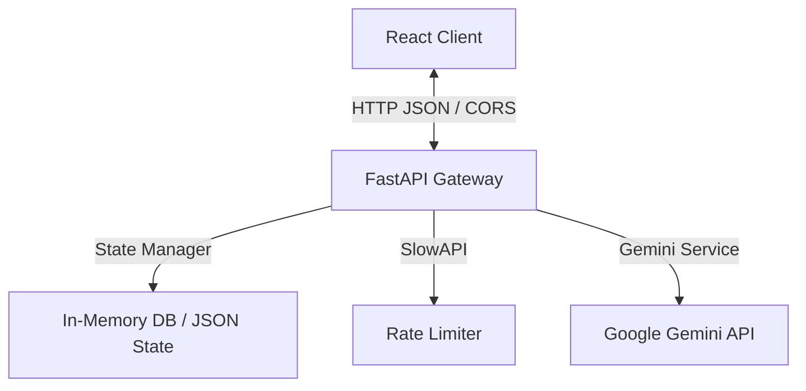
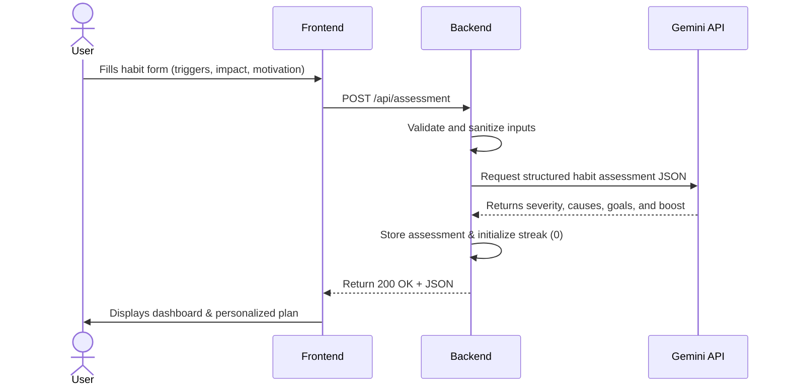
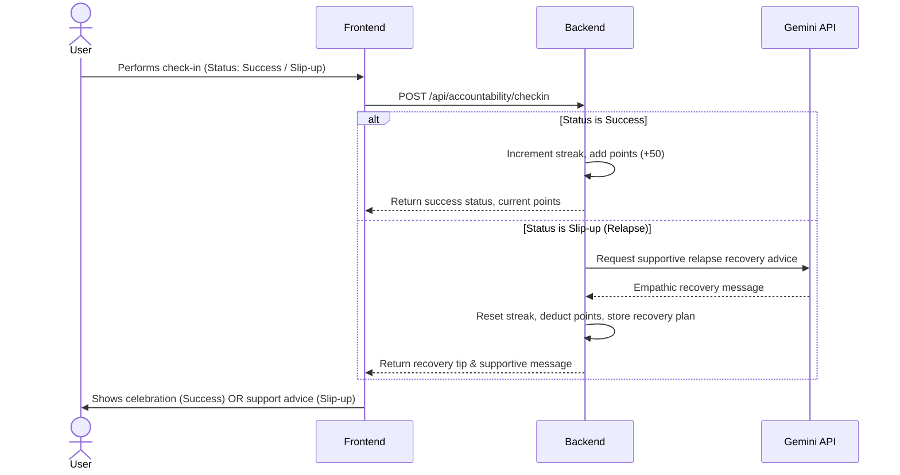

# 🌱 HabitBuddy - GenAI Habit Breaker App

HabitBuddy is a modern, responsive, and empathetic web application designed to help users identify, understand, and break unwanted habits (such as screen time addiction, nail-biting, or late-night scrolling). 

Powered by the **Google Gemini API** (using `gemini-3.5-flash`), the application offers a dual-engine architecture: a Python (FastAPI) backend managing state, rate-limiting, and LLM orchestration; and a React (Vite + Tailwind CSS + Framer Motion) frontend delivering a calming, accessible user interface.

---

## 🏗️ Architecture & Workflows

### System Architecture
The application is structured into a clean backend-frontend separation:



### 1. Onboarding Assessment Workflow


### 2. Accountability & Relapse Recovery Workflow


---

## 🌟 Core Features

1. **Habit Assessment**: AI-driven analysis of habit patterns, severity levels, root causes, and recommended weekly/monthly targets.
2. **AI Coaching Chat**: "HabitBuddy", an empathetic AI coach that provides actionable suggestions under 150 words and asks exactly one question to keep the user engaged.
3. **Smart Nudges**: Provides immediate context-aware alternatives and recovery tips based on current triggers, mood, or activities.
4. **Interactive Dashboard**: Responsive data visualization utilizing Recharts to track streaks, weekly check-in outcomes, and milestone achievements.
5. **Coping Strategies**: A filterable collection of physical, mental, and social strategies with real-time user ratings.
6. **Accountability Check-Ins**: Daily logging. If a user logs a slip-up, the system provides real-time supportive advice to encourage restart.
7. **Personal Insights**: Weekly summaries, pattern correlations, and relapse risk predictions (Low/Medium/High) powered by Gemini.
8. **Gamification**: Users earn experience points and unlock unlockable milestone badges (e.g., *Day 1 Catalyst*, *Week 1 Mindful Ruler*) as they keep up their streaks.

---

## 🛠️ Tech Stack & Key Features

* **Backend**:
  * **FastAPI**: Clean, type-safe API routing.
  * **Google Generative AI SDK**: Direct integration with Gemini model API.
  * **Pydantic**: Robust schema models and input validation.
  * **SlowAPI**: Rate limiting (configured at 60 requests/minute).
  * **Pytest & Coverage**: Automated unit/endpoint tests with over 90% code coverage.
* **Frontend**:
  * **React (Vite)**: Rapid rendering and state updates.
  * **Tailwind CSS**: Custom calming gradients, dark/light mode integration.
  * **Framer Motion**: Smooth micro-animations for tab changes and buttons.
  * **Recharts**: Responsive data visualization.
  * **Jest & React Testing Library**: Unit tests for interactive UI components.

---

## 🚀 Getting Started

### Prerequisites
* Python 3.10+
* Node.js 18+

### Setup backend
1. Navigate to the backend directory:
   ```bash
   cd backend
   ```
2. Create and activate a virtual environment:
   ```bash
   python -m venv venv
   source venv/bin/activate  # On Windows: .\venv\Scripts\activate
   ```
3. Install dependencies:
   ```bash
   pip install -r requirements.txt
   ```
4. Create a `.env` file inside the `backend/` directory:
   ```env
   GEMINI_API_KEY=YOUR_GEMINI_API_KEY
   CORS_ORIGINS=["http://localhost:5173", "http://127.0.0.1:5173"]
   RATE_LIMIT=60/minute
   ```
5. Start the backend:
   ```bash
   python -m uvicorn main:app --host 127.0.0.1 --port 8000
   ```

### Setup frontend
1. Navigate to the frontend directory:
   ```bash
   cd ../frontend
   ```
2. Install Node packages:
   ```bash
   npm install
   ```
3. Start the Vite development server:
   ```bash
   npm run dev
   ```
4. Open the app in your browser: [http://localhost:5173](http://localhost:5173)

---

## 🧪 Testing

### Running Backend Tests
From the root directory:
```bash
.\venv\Scripts\python -m pytest --cov=backend backend/tests/
```

### Running Frontend Tests
From the frontend directory:
```bash
npm test
```
